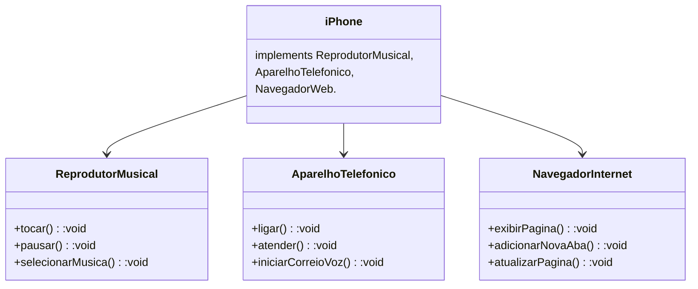

#  poo - Desafio

Com base nos conhecimentos adquiridos em aula, foi proposto criar um diagrama UML de um componente IPhone modelo 2007.

### Contexto  
Com base no vídeo de lançamento do iPhone de 2007 (link abaixo), você deve elaborar a diagramação das classes e interfaces utilizando uma ferramenta UML de sua preferência. Em seguida, implemente as classes e interfaces no formato de arquivos .java.
 - [Lançamento iPhone 2007](https://www.youtube.com/watch?v=9ou608QQRq8)
- Minutos relevantas: 00:15 até 00:55

### Funcionalidades a Modelar
1. Reprodutor Musical
- Métodos: tocar(), pausar(), selecionarMusica(String musica)
2. Aparelho Telefônico
- Métodos: ligar(String numero), atender(), iniciarCorreioVoz()
3. Navegador na Internet
- Métodos: exibirPagina(String url), adicionarNovaAba(), atualizarPagina()
### Objetivo
1. Criar um diagrama UML que represente as funcionalidades descritas acima.
2. Implementar as classes e interfaces correspondentes em Java (Opcional).

### Diagrama UML (Mermaid)

## Aula Ministra por:

- [Gleyson Sampaio](https://www.linkedin.com/in/glysns/) no Bootcamp Santander Back-End Java em parceria com a [DIO](https://www.dio.me/en)

